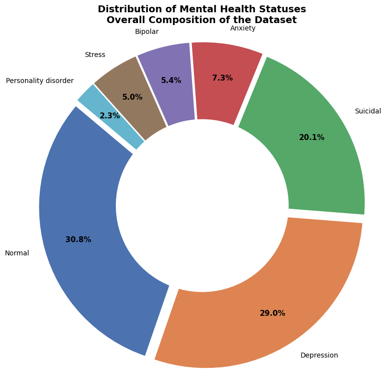
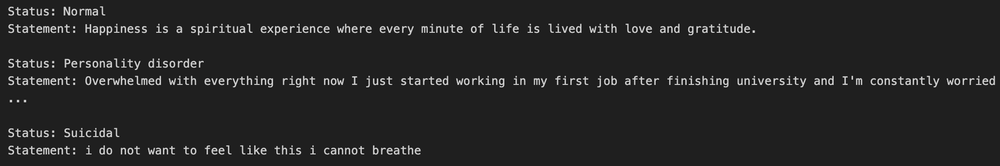
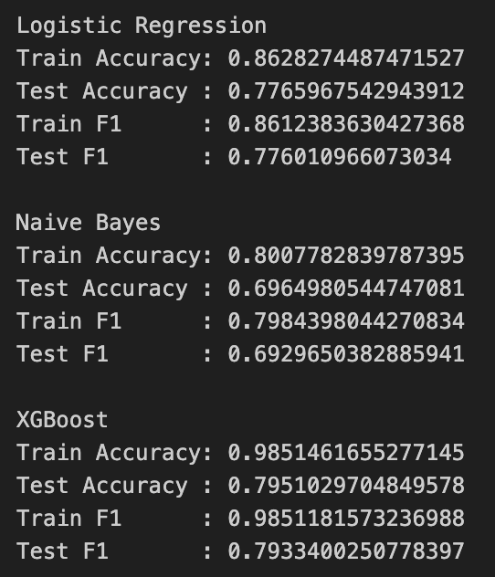

# 🧠 Mental Health Status Detection from Text

Language plays a central role in how individuals express emotional and psychological states. This project uses machine learning and text analysis to explore how different mental health statuses (such as depression, anxiety, stress, and suicidal ideation) are expressed through language in online posts. A key focus of the project is **interpretability**: rather than only predicting labels, we identify **status-specific words** and visualize them using **word clouds** to better understand how different mental health conditions are linguistically expressed.

## 🎯 Research Objectives

In addition to **mental health status classification**, this project explores the following question:

* **Are certain words uniquely associated with specific mental health conditions?**

## 📂 Dataset

**Sentiment Analysis for Mental Health Dataset**
🔗 [https://www.kaggle.com/datasets/suchintikasarkar/sentiment-analysis-for-mental-health](https://www.kaggle.com/datasets/suchintikasarkar/sentiment-analysis-for-mental-health)

### Dataset Features

* `statement`: text from online posts
* `status`: labeled mental health condition

**Mental health categories include:**
Normal, Depression, Suicidal, Anxiety, Bipolar, Stress, Personality disorder

**Unit of analysis:** Individual text statement

## 🛠️ Methods Used

* Sentiment analysis
* Word cloud visualization for status-specific language

## 🎓 Course Information

**Course:** STATS 201

## End-to-End Pipeline

Pipeline logic:

Raw text dataset
→ Data exploration & preprocessing
→ TF-IDF feature extraction
→ Model training (Logistic Regression, Naive Bayes, XGBoost)
→ Model diagnostics (confusion matrices, misclassified samples)
→ Linguistic interpretation (TF-IDF & Fighting Words)

---

## Data Source

* **Dataset:** Sentiment Analysis for Mental Health (Kaggle)
* **Features:**

  * `statement` (text)
  * `status` (mental health label)

---

## Mental Health Status Distribution

The dataset is imbalanced, with Normal and Depression dominating.

**Figure: Class distribution of mental health statuses**

---

## Notebook: `CourseProjectMentalHealth.ipynb`

---

## 1. Import & Load

* Loaded dataset using pandas
* Verified dataset shape and column names

---

## 2. Initial Exploration

* Displayed sample statements per class
* Checked for missing values
* Verified class imbalance

**Figure: Example statements by mental health status**

---

## 3. Text Preprocessing

Steps applied to the `statement` column:

* Converted text to lowercase
* Removed URLs, punctuation, markdown links, and special characters
* Tokenized text
* Applied **Porter stemming** to reduce word variants
* Stored results in:

  * `tokens`
  * `tokens_stemmed`

This ensured consistent feature representation and reduced vocabulary size.

---

## 4. Feature Engineering

* Created **TF-IDF vectors** for:
  * Unigrams
  * Bigrams
* Used stop-word removal
* Limited vocabulary size for interpretability

---

## 5. Exploratory Text Analysis

### Word Cloud Visualization by Mental Health Status

To explore dominant vocabulary patterns before formal modeling, word clouds were generated for each mental health status. These visualizations highlight the most frequent and salient words used within each category and provide an intuitive overview of how language differs across conditions.

**Figures:**

* Anxiety — Word Cloud - Unigram
* Anxiety — Word Cloud - Bigram

.png)
.png)

---

## 6. Model Training

### Models Trained

* Logistic Regression
* Multinomial Naive Bayes
* XGBoost Classifier

### Train/Test Split

* Stratified 80/20 split
* Same TF-IDF representation used across models

---

## 7. Model Evaluation

Metrics used:

* Accuracy
* F1-score
* Confusion matrices

**Figures:**

* Confusion Matrix — Logistic Regression
* Confusion Matrix — Naive Bayes
* Confusion Matrix — XGBoost

.png)
.png)
.png)

---

## 8. Error Analysis

### Misclassified Samples

* Examined samples misclassified across models
* Found consistent confusion between:

  * Depression ↔ Suicidal
  * Anxiety ↔ Stress
  * Personality disorder ↔ Depression

This indicated linguistic overlap rather than random error.

---

## 9. Bias–Variance Diagnostics

* Naive Bayes: underfitting (low train & test performance)
* XGBoost: overfitting (large train–test gap)
* Logistic Regression: best bias–variance trade-off

**Figure: Train vs Test Accuracy and F1 Comparison**

---

## 10. Linguistic Distinctiveness Analysis

### TF-IDF Interpretation

TF-IDF highlights **frequent and interpretable phrases** used within each mental health status.

**Figures:**

* TF-IDF Top 20 Bigrams per Status

.png)
.png)
.png)
.png)
.png)
.png)
.png)

---

### Fighting Words Method

Implemented a log-odds–based Fighting Words approach for bigrams.

* Compares one class vs all others
* Computes z-scores for distinctiveness

**Figures:**

* Fighting Words — Anxiety
* Fighting Words — Depression
* Fighting Words — Suicidal
* Fighting Words — Stress
* Fighting Words — Bipolar
* Fighting Words — Personality Disorder

.png)
.png)
.png)
.png)
.png)
.png)
.png)

---

## 11. Method Comparison: TF-IDF vs Fighting Words

* **TF-IDF:** clear, human-readable, suitable for public interpretation
* **Fighting Words:** statistically strong, highlights extreme distinctions

**Final choice:** TF-IDF bigrams
Reason: better alignment with accessibility and interpretability goals.

---

## Scope

* Identifies **textual patterns**, not clinical diagnoses
* Not a medical or diagnostic tool
* Intended for exploratory and educational analysis

---

## Limitations

* Self-reported text introduces noise
* Label quality is uncertain
* Class imbalance affects minority classes
* Short statements limit contextual understanding

---

## Conclusion

The project shows that while mental health conditions share a common conversational language, **distinctive phrases still emerge** for each status. Understanding *how* people express mental health experiences is as important as predicting labels.
